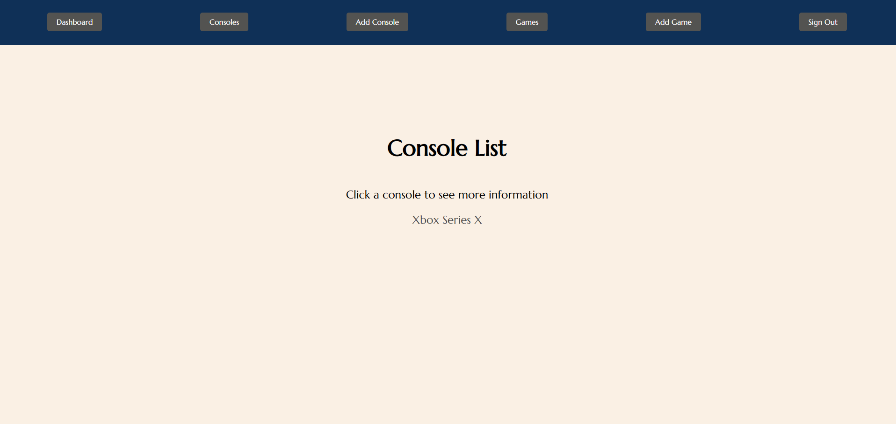

# Videogame Library App

## An app to log videogames or consoles and stores them in a mongoDB database. Uses React for the fron-end and Express for the back-end

## Technologies

## Attributions

## Attributions

[ExpressJS Documentation](https://expressjs.com/) | [React Documentation](https://react.dev/) | [Stack overflow](https://stackoverflow.com/) | [Contrast Accessibility Checker](https://webaim.org/resources/contrastchecker/) |

## App Images

## Future Updates

I plan on adding a feature to view all of the users on one page. Clicking on the user would davigate you to their profile displaying their saved games

## Author

Cesar Preza [LinkdIn](https://www.linkedin.com/in/cesar-preza-72675278/) [GitHub](https://github.com/Cpreza24)
